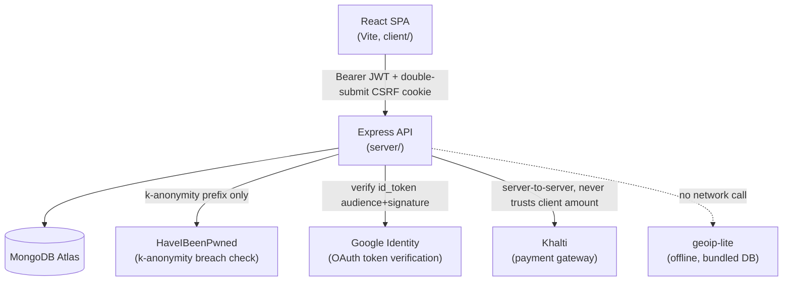
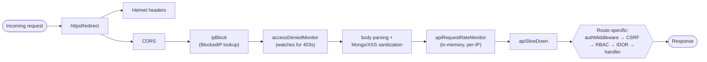

# SkillSwap Security Engineering Report

**Project:** SkillSwap — peer-to-peer skill-exchange marketplace
**Scope of this report:** authentication & session management, password policy, authorization (RBAC + IDOR), field-level encryption, audit logging, suspicious-activity monitoring, and the manual penetration test conducted against all of the above.
**Companion documents:** [`pentest-report.md`](./pentest-report.md) (full findings, CVSS scores, PoCs), [`key-management.md`](./key-management.md) (encryption key rotation procedure).

---

## 1. Executive Summary

SkillSwap's backend already had a substantial security baseline before this engagement — bcrypt password hashing, JWT access/refresh tokens with device fingerprinting, progressive account lockout, a tamper-evident hash-chained audit log, CSP/HSTS/CORS headers, and CSRF protection on most mutating routes. This engagement's work fell into three categories:

1. **New capability**: field-level encryption for PII (email, MFA secrets), a consolidated password-policy service, generic IDOR-protection middleware, suspicious-activity detection (failed-login spikes, JWT/refresh-token reuse, impossible travel, request-rate abuse), and a programmatic RBAC audit tool.
2. **Consolidation**: several of the above already existed but were duplicated across 3-4 call sites with inconsistent enforcement (e.g. password complexity was checked three different ways in three routes; zxcvbn score was computed but never actually enforced anywhere).
3. **Vulnerability remediation**: manual penetration testing found 6 real issues, 4 of which were fixed during this engagement (including one critical authentication bypass), documented in full in the companion pentest report.

**Highest-impact finding**: `/api/auth/mfa/verify` required no password and had no rate limiting, making it a complete, brute-forceable authentication bypass for any account with MFA enabled. Fixed. See [`pentest-report.md`](./pentest-report.md) PT-02.

---

## 2. Architecture Overview



The Express API is a pure JSON backend — it never serves the React app's HTML (verified: no `express.static` call anywhere in the codebase), which is why CSP/security headers exist in *two* places: a Helmet config on the API (defense-in-depth, protects any HTML the API ever emits) and a build-time-injected `<meta>` CSP in the client's production `index.html` (the one that actually protects the browser session, since that's what the browser evaluates).

### Middleware pipeline (request path)



---

## 3. Threat Model

Threats considered, using a STRIDE-based walk of the authentication and authorization surface (the areas this engagement touched):

```mermaid
flowchart TD
    subgraph Spoofing
        S1["Stolen/replayed JWT"]
        S2["Forged client IP<br/>(X-Forwarded-For)"]
    end
    subgraph Tampering
        T1["Audit log entry modified"]
        T2["Client-supplied resource ownership"]
    end
    subgraph Repudiation
        R1["Admin denies performing an action"]
    end
    subgraph InfoDisclosure
        I1["PII in DB at rest"]
        I2["PII over the API"]
    end
    subgraph DoS
        D1["Credential-stuffing / brute force"]
        D2["Request flooding"]
    end
    subgraph Elevation
        E1["Learner accesses tutor/admin routes"]
        E2["User A accesses User B's resource"]
    end

    S1 -->|"mitigated"| M1["Device fingerprint (UA+IP hash)<br/>bound into JWT; mismatch → alertJwtReuse"]
    S2 -->|"mitigated (this engagement)"| M2["app.set('trust proxy', 1) in production"]
    T1 -->|"mitigated"| M3["SHA-256 hash-chained AuditLog,<br/>immutable (blocks findOneAndUpdate)"]
    T2 -->|"mitigated (this engagement)"| M4["requireOwnership middleware —<br/>server derives ownership, never trusts client"]
    R1 -->|"mitigated"| M5["Every admin action audit-logged<br/>with actor id + role at time of action"]
    I1 -->|"mitigated (this engagement)"| M6["AES-256-GCM field encryption<br/>(email, mfa_secret)"]
    I2 -->|"partially mitigated — PT-01 open"| M7["Most PII gated by auth;<br/>public-profile email leak still open"]
    D1 -->|"mitigated"| M8["Progressive lockout + authRateLimiter<br/>+ repeated-failed-login alerting"]
    D2 -->|"mitigated"| M9["apiSlowDown + in-memory<br/>per-IP request-rate detector"]
    E1 -->|"mitigated"| M10["requireRole middleware, RBAC-audited<br/>(29/29 automated checks)"]
    E2 -->|"mitigated (this engagement)"| M11["requireOwnership middleware,<br/>IDOR-audited"]
```



Two branches are explicitly **not fully closed**: PT-01 (public email disclosure) and PT-05 (registration user enumeration) — both require a product decision (what should a "public profile" contain; whether registration should give immediate existence feedback) rather than a pure code fix, so they're documented as open recommendations rather than silently changed. See the pentest report for the reasoning.

---

## 4. Design & Implementation

### 4.1 Authentication & session management (pre-existing, unchanged)

- Passwords hashed with bcrypt, cost factor 12.
- Access tokens (15 min) + refresh tokens (7 days), both carrying a SHA-256 device fingerprint (`hash(User-Agent + IP)`) and a `jti`. A fingerprint mismatch on an otherwise-valid token means the token is being replayed from a different device — flagged via `alertJwtReuse` (new this engagement).
- Refresh-token rotation: `RevokedToken` records each token's `jti` on logout/refresh; a revoked `jti` being presented again is a reuse signal — flagged via `alertRefreshTokenReuse` (new this engagement).

### 4.2 Password policy (`server/src/services/passwordPolicy.js`)

Consolidates what was three duplicated express-validator regex chains, an unenforced zxcvbn call, and a separately-duplicated HIBP check into one module:

```js
const POLICY = {
  minLength: 12,
  requireUppercase: true, requireLowercase: true,
  requireNumber: true, requireSpecialChar: true,
  minZxcvbnScore: 2,   // NEW — the enforcement gap this closes
  expiryDays: 90,
  historyDepth: 5,
};

async function validateNewPassword(password, { userInputs = [] } = {}) {
  const errors = checkComplexity(password);
  const strength = evaluateStrength(password, userInputs);
  if (strength.score < POLICY.minZxcvbnScore) {
    errors.push(strength.feedback?.warning || 'Password is too weak or easily guessable');
  }
  if (errors.length === 0) {          // skip the network call if already rejected
    const breachCount = await checkBreached(password);
    if (breachCount > 0) errors.push(`This password has appeared in ${breachCount} data breach(es).`);
  }
  return { valid: errors.length === 0, errors, score: strength.score, feedback: strength.feedback };
}
```

Before this, `Password123!` — 12 characters, upper/lower/digit/symbol present — passed every check despite scoring 1/4 on zxcvbn (a top password-spraying candidate). See PT-06.

The real-time validation endpoint (`POST /password-strength`) always runs complexity + score (fast, synchronous); the HIBP network call only runs when the client explicitly requests it (`checkBreach: true`), so it's suitable for on-keystroke feedback without adding ~300ms of latency to every character typed.

### 4.3 Authorization: RBAC + IDOR protection

RBAC (`middleware/rbac.js`, pre-existing) gates by role at the route level. IDOR protection (`middleware/requireOwnership.js`, new) gates by *resource ownership* — a distinct concern RBAC doesn't cover: a learner is allowed to cancel bookings (RBAC), but only *their own* booking (IDOR).

```js
function requireOwnership(Model, { idParam = 'id', ownerFields, resourceName, allowAdmin = false } = {}) {
  const owners = Array.isArray(ownerFields) ? ownerFields : [ownerFields];
  return async (req, res, next) => {
    const doc = await Model.findById(req.params[idParam]);
    if (!doc) return res.status(404).json({ msg: `${resourceName} not found` });

    const isOwner = owners.some((f) => doc[f]?.toString() === req.user.id);
    if (!isOwner && !(allowAdmin && req.user.role === 'admin')) {
      logEvent(req.user.id, 'idor.access_denied', { resource: resourceName, resourceId: doc._id, status: 'failure', ... });
      return res.status(403).json({ msg: `Forbidden: you do not have access to this ${resourceName.toLowerCase()}` });
    }
    req.resource = doc;   // handler reuses this — one DB round-trip, not two
    next();
  };
}
```

This replaced hand-written, inconsistent checks — including one genuine bug it eliminated: `users.js`'s `/:id/profile` route had `User.findOne({ _id: req.params.id, _id: req.user.id })`, a duplicate object key that JavaScript silently resolves to the second value. The query itself enforced nothing; only the explicit `if` check above it protected the route. Not exploitable as it stood, but exactly the kind of fragile, easy-to-regress pattern centralizing the check eliminates.

**Verification, not just implementation**: `server/scripts/rbacAudit.js` programmatically exercises this — bootstraps real learner/tutor/admin/otherLearner accounts, seeds a listing and a booking, and checks actual vs. expected HTTP status across the RBAC/IDOR surface. Current result: **29/29 passing**.

### 4.4 Field-level encryption (`server/src/utils/fieldEncryption.js`)

AES-256-GCM (replacing an AES-256-CBC utility that had no integrity check) with a version-prefixed stored format:

```
v<key-version>:<iv-hex>:<auth-tag-hex>:<ciphertext-hex>
```

Applied to `email` and `mfa_secret` on the User model via Mongoose getter/setter transforms — transparent to the rest of the codebase (`user.email` reads/writes exactly as before; encryption happens in the schema layer). `email` additionally needs a **blind index** (`email_lookup_hash`, an HMAC-SHA256 of the normalized address) because GCM's non-deterministic IV means the same plaintext never produces the same ciphertext twice, so `findOne({ email })` can never match against it.

Migration is **dual-read, lazy-write**, not a flag-day cutover — this repository had 3 real user accounts with plaintext email at the time this shipped, and a botched one-shot migration is an unacceptable failure mode for the field that gates login:

```js
userSchema.statics.findByEmail = async function (email) {
  const byHash = await this.findOne({ email_lookup_hash: hashForLookup(email) });
  if (byHash) return byHash;
  // Legacy fallback — MUST bypass the schema layer: Mongoose applies a
  // SchemaType's custom `set` transform to query filter values too, so
  // `this.findOne({ email })` would silently re-encrypt the query value
  // with a fresh random IV and never match anything stored.
  const rawLegacy = await this.collection.findOne({ email: normalized });
  if (!rawLegacy) return null;
  const legacy = this.hydrate(rawLegacy);
  legacy.email = normalized;   // triggers the encrypting setter
  await legacy.save();          // opportunistically migrated from here on
  return legacy;
};
```

That query-cast behavior — Mongoose applying a field's custom setter to query filters, not just document assignment — bit this exact codebase twice during development (once in the model itself, once in the RBAC audit script's test-account bootstrapping), which is why it's called out explicitly in both places rather than left as an implicit assumption. Full rotation procedure, pepper/key separation rationale, and the "why not a flag-day migration" discussion: [`key-management.md`](./key-management.md).

### 4.5 Suspicious activity monitoring (`server/src/services/securityMonitor.js`)

Seven detectors, writing to a `SecurityAlert` collection surfaced on an admin dashboard:

| Detector | Mechanism |
|---|---|
| >10 failed logins | Reuses the existing per-account lockout checkpoint |
| Repeated access denied | Global `res.on('finish')` hook watching every 403, any route |
| JWT reuse | Existing fingerprint-mismatch check in `middleware/auth.js` |
| Refresh-token reuse | Existing `RevokedToken` replay check in `/refresh` |
| Excessive password-reset requests | Generic per-IP threshold helper (TTL collection) |
| Excessive API requests | **In-memory** sliding window — a DB write on every single API request just to watch for a rare event isn't the right cost/benefit; this is how `express-rate-limit` itself works |
| Multiple countries in a short period | `geoip-lite` (offline, no network call) resolves country per login; >1 distinct country in 60 min → alert |

All seven share a dedup guard (`alertOnceWithin`) — a sustained attack produces one actionable alert, not one per request.

### 4.6 Audit trail (`server/src/models/AuditLog.js`)

Tamper-evident: each entry's hash covers its content plus the previous entry's hash (blockchain-style chaining). This predates the current engagement but was extended with `role`/`resource`/`resourceId`/`status` as first-class fields (previously a free-form metadata blob) — done in a **version-aware** way (`schemaVersion` per entry) specifically because this collection already had 48 real entries hashed under the old formula; a naive change would have made `verifyAuditChain()` report every one of them as tampered.

---

## 5. Testing & Verification Methodology

Every change in this engagement was verified against a live server and the real (dev) MongoDB Atlas database, not just read for correctness:

- **Encryption round-trip**: registered a real account, confirmed raw DB storage was ciphertext, confirmed the API returned decrypted plaintext, confirmed the legacy dual-read fallback found and lazily migrated a manually-inserted plaintext record, confirmed the 3 pre-existing real accounts still read correctly (zero regressions).
- **MFA**: generated a real TOTP code with `speakeasy` against a freshly-encrypted secret and verified the full setup → encrypt → decrypt → verify → issue-tokens path.
- **IDOR**: registered two accounts, confirmed cross-account access is blocked with a 403 and produces an `idor.access_denied` audit entry.
- **RBAC**: `scripts/rbacAudit.js`, 29/29 passing (see §4.3).
- **Rate limiting**: confirmed the MFA fix with 6 rapid requests (5 through, 6th → 429).
- **CSRF**: confirmed a request to the newly-protected admin route without a CSRF token is rejected before authorization is even checked.

Three real bugs were caught and fixed *during* this verification (not left in the shipped code): a Mongoose-9 API change (`pre('validate')` hooks no longer take a `next` callback — an artifact of upgrading a pattern from an older Mongoose convention), the query-cast-vs-setter interaction described in §4.4, and a middleware-ordering bug in an earlier engagement pass where a rate-based monitor was counting *after* a request-delaying middleware instead of before it, making bursts look artificially spread out.

---

## 6. Findings Summary

See [`pentest-report.md`](./pentest-report.md) for full detail. Six findings, four remediated during this engagement:

| ID | Title | CVSS | Status |
|---|---|---|---|
| PT-01 | Unauthenticated PII disclosure via public tutor profile | 5.3 (Med) | Open — recommendation given |
| PT-02 | Authentication bypass via unthrottled MFA brute force | **9.1 (Critical)** | **Fixed** |
| PT-03 | Missing CSRF protection on admin routes | 6.5 (Med) | **Fixed** |
| PT-04 | Missing `trust proxy` config | 7.5 (High) | **Fixed** |
| PT-05 | User enumeration via registration | 5.3 (Med) | Open — recommendation given |
| PT-06 | Weak password acceptance (score never enforced) | 6.5 (Med) | **Fixed** |

---

## 7. Recommendations / Future Work

Ordered roughly by impact-to-effort:

1. **Per-account MFA rate limiting**, independent of source IP (residual risk noted in PT-02) — a distributed attacker can still spread attempts across many IPs against the current per-IP limiter.
2. **Resolve PT-01/PT-05** — both need a product decision, not just code: whether public tutor profiles should include email at all, and whether registration should give immediate account-existence feedback or move to an email-verification-gated flow.
3. **`config/validateEnv.js`** should require `ENCRYPTION_KEYS`/`LOOKUP_HASH_PEPPER` in production, the same way it already hard-fails on missing `JWT_SECRET` — currently the dev fallback (deriving a key from `ENCRYPTION_KEY`) would silently work in production too if the newer vars are never set.
4. **Eager PII migration**: `scripts/migrateEncryptPII.js --apply` was dry-run-tested but deliberately not run against this project's 3 real accounts — left as an explicit operator decision (see §4.4 and `key-management.md`).
5. **Automated key rotation tooling** — the rotation *procedure* is documented and the format supports it (versioned), but there's no scheduled job that performs a rotation sweep; it's a manual/scripted process today.
6. **Extend `requireOwnership`** to a few more routes that still use hand-written ownership checks (e.g. `tutorApplications.js`'s document-download route) — not urgent, since those checks are currently correct, just inconsistent in style with the newer middleware.
